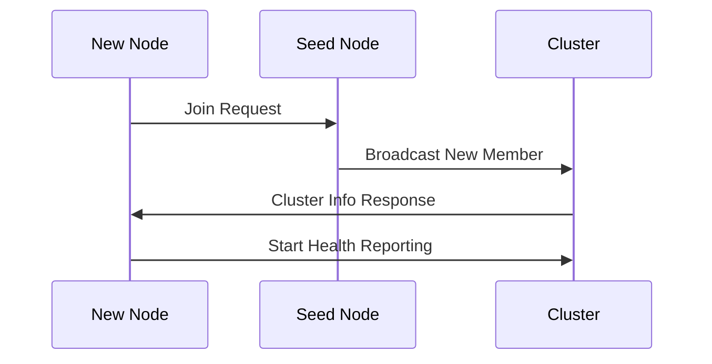

## System Overview

Distributed LLM is designed as a cloud-native, horizontally scalable system for running Large Language Models across multiple compute nodes. The architecture follows microservices principles with strong observability and auto-scaling capabilities.

## Core Components

### 1. Agent Nodes

Agent nodes are the compute workhorses of the system:

```go
type Agent struct {
    ID          string
    Resources   ResourceInfo
    Status      NodeStatus
    P2PNetwork  *P2PNetwork
    Broadcaster *Broadcaster
    Metrics     *MetricsCollector
}
```

**Responsibilities:**
- Host LLM model layers
- Participate in distributed inference
- Report health and metrics
- Discover and coordinate with peers

### 2. TUI Client

The Terminal User Interface provides cluster management:

- Real-time cluster visualization
- Model deployment and management
- Inference request submission
- Retro terminal aesthetics with glitch effects

### 3. Discovery Service

Handles cluster formation and node discovery:

```protobuf
service DiscoveryService {
    rpc DiscoverNodes(DiscoveryRequest) returns (DiscoveryResponse);
    rpc RegisterWithCluster(ClusterJoinRequest) returns (ClusterJoinResponse);
    rpc LeaveCluster(ClusterLeaveRequest) returns (ClusterLeaveResponse);
    rpc GetClusterInfo(ClusterInfoRequest) returns (ClusterInfoResponse);
}
```

### 4. Monitoring Stack

- **Prometheus**: Metrics collection and storage
- **Grafana**: Visualization and alerting
- **Custom Metrics**: Application-specific performance indicators

## Communication Architecture

### gRPC with Protocol Buffers

All inter-service communication uses gRPC with Protocol Buffers for:

- Type safety and performance
- Built-in compression (gzip)
- Streaming capabilities for real-time updates

```go
// Example: Node service with compression
server := grpc.NewServer(
    grpc.RPCCompressor(grpc.NewGZIPCompressor()),
    grpc.RPCDecompressor(grpc.NewGZIPDecompressor()),
)
```

### P2P Networking

Nodes use memberlist for gossip-based discovery:

- Automatic peer discovery
- Failure detection
- Cluster membership management
- Event broadcasting

## Data Flow

### Node Registration



### Inference Request

```mermail
sequenceDiagram
    participant T as TUI Client
    participant A1 as Agent 1
    participant A2 as Agent 2
    participant A3 as Agent 3
    
    T->>A1: Inference Request
    A1->>A2: Forward Partial Result
    A2->>A3: Continue Processing
    A3->>T: Final Response
```

## Deployment Architecture

### Kubernetes Native

The system is designed for Kubernetes with:

```yaml
# DaemonSet for node coverage
apiVersion: apps/v1
kind: DaemonSet
metadata:
  name: distributed-llm-agent
spec:
  template:
    spec:
      containers:
      - name: agent
        image: distributed-llm:latest
        resources:
          requests:
            memory: "2Gi"
            cpu: "1000m"
          limits:
            memory: "8Gi"
            cpu: "4000m"
```

### Auto-scaling

#### Vertical Pod Autoscaler (VPA)

```yaml
apiVersion: autoscaling.k8s.io/v1
kind: VerticalPodAutoscaler
metadata:
  name: distributed-llm-agent-vpa
spec:
  targetRef:
    apiVersion: apps/v1
    kind: DaemonSet
    name: distributed-llm-agent
  updatePolicy:
    updateMode: "Auto"
  resourcePolicy:
    containerPolicies:
    - containerName: agent
      maxAllowed:
        cpu: "8"
        memory: "32Gi"
      minAllowed:
        cpu: "500m"
        memory: "1Gi"
```

#### KEDA Horizontal Scaling

```yaml
apiVersion: keda.sh/v1alpha1
kind: ScaledObject
metadata:
  name: distributed-llm-cpu-scaler
spec:
  scaleTargetRef:
    name: distributed-llm-agent
  triggers:
  - type: prometheus
    metadata:
      serverAddress: http://prometheus:9090
      metricName: node_cpu_utilization
      threshold: '70'
      query: avg(distributed_llm_node_cpu_percent)
```

## Security Architecture

### Network Security

- mTLS for inter-node communication
- Network policies for pod isolation
- Service mesh integration ready

### Resource Isolation

- Container resource limits
- Namespace isolation
- RBAC controls

## Performance Characteristics

### Latency Targets

- Node discovery: < 100ms
- Health checks: < 50ms
- Inference routing: < 10ms
- Metrics collection: < 5ms

### Scalability

- **Horizontal**: 100+ nodes per cluster
- **Vertical**: 32GB+ memory per node
- **Model Size**: Up to 70B parameters
- **Throughput**: 1000+ requests/second

## Monitoring and Observability

### Metrics Categories

1. **System Metrics**
   - CPU, memory, disk usage
   - Network throughput
   - Container health

2. **Application Metrics**
   - Request latency
   - Error rates
   - Model loading times
   - Inference throughput

3. **Business Metrics**
   - Model accuracy
   - User satisfaction
   - Resource utilization efficiency

### Tracing

Distributed tracing with OpenTelemetry integration for:
- Request flow visualization
- Performance bottleneck identification
- Error propagation tracking

## Future Architecture

### Planned Enhancements

- **Model Sharding**: Automatic layer distribution
- **Load Balancing**: Intelligent request routing
- **Caching**: Model and result caching layers
- **Multi-cloud**: Cross-cloud cluster federation
